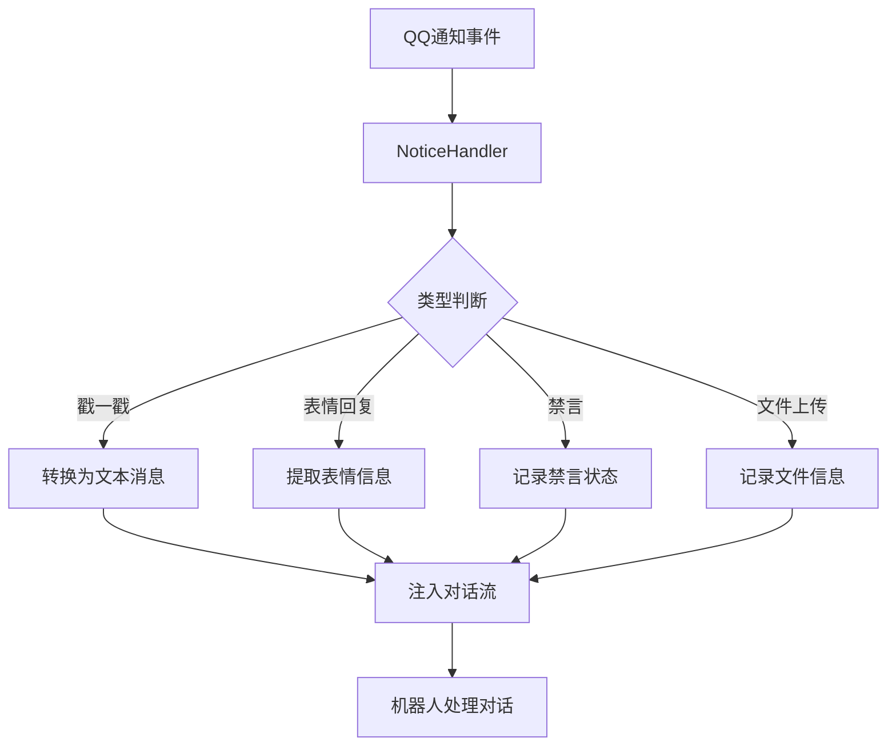

# Notice Injector 通知处理器

> *把QQ的"小动作"，变成机器人的"懂你"。*

**QQ通知消息处理与主动交互插件** — Neo-MoFox 插件

---

## ✨ 不止是通知，更是连接

普通的通知系统是一道墙：机器人收到了，但不知道怎么回应。

Notice Injector 不一样。它会：

- 把"戳一戳"变成机器人能看懂的消息："用户A戳了戳你"
- 把"表情回复"变成对话的一部分："用户B给你的消息点了赞"
- 还能让机器人主动去戳一戳、点个赞，像真人一样互动

这不是简单的消息转发，这是**通知语义化**驱动的交互桥梁。

### 它能做什么

#### 接收通知，转化理解
- **戳一戳通知** — 有人戳机器人时，转化为文本消息注入对话
- **表情回复通知** — 有人给机器人消息点赞时，同步到对话流
- **禁言通知** — 有人被禁言/解除禁言时，记录到对话历史
- **文件上传通知** — 群里有人上传文件时，通知机器人处理

#### 主动交互，拉近距离
- **发送戳一戳** — 机器人可以主动戳一戳用户引起注意
- **AOE 戳一戳** — 机器人可以同时戳多个活跃用户（每人一次）
- **发送表情回复** — 机器人可以给用户消息点赞、表达情绪（仅群聊）
- **全场景支持** — 所有功能同时支持私聊和群聊

---

## 🏗 架构

### 原生 Action 支持

Notice Injector 通过框架的原生 Action 系统提供交互能力：

| 动作               | 用途                     | 参数                                   |
|--------------------|--------------------------|----------------------------------------|
| `send_poke`        | 单用户连戳多次           | `user_id`(必选), `group_id`(可选), `poke_count`(可选), `target_user_id`(可选), `target_group_id`(可选) |
| `send_poke_multiple` | 多用户各戳一次（AOE）  | `user_ids`(必选), `group_id`(必选), `max_targets`(可选，默认5), `validate_targets`(可选，默认true) |
| `send_emoji_like`  | 发送表情回复（仅群聊）   | `message_id` (必选), `emoji_id` (可选，默认126) |

### 通知处理流程



---

## 📁 文件结构

```
notice_injector/
├── manifest.json            # 插件元数据
├── plugin.py                # 插件入口，注册组件与事件
├── config.py                # 配置定义
├── LICENSE                  # MIT 许可证
├── README.md                # 插件文档
└── actions/
    ├── poke.py              # send_poke 动作实现
    └── emoji_like.py        # send_emoji_like 动作实现
```

---

## ⚙️ 配置

配置文件首次运行自动生成，路径：`config/plugins/notice_injector/config.toml`

### 配置节：`[plugin]`

> 当前插件所有配置均位于 `[plugin]` 下（无 `[features]` 节）。

| 配置项 | 默认值 | 说明 |
|---|---:|---|
| `enabled` | `true` | 插件总开关 |
| `enable_poke` | `true` | 是否处理戳一戳通知 |
| `enable_emoji_like` | `true` | 是否处理表情回复通知 |
| `enable_ban` | `true` | 是否处理禁言通知 |
| `enable_group_upload` | `true` | 是否处理文件上传通知 |
| `enable_debug` | `false` | 是否输出调试日志 |
| `ignore_self_notice` | `true` | 是否忽略机器人自己触发的通知 |
| `trigger_chat` | `false` | 是否将通知注入对话流触发聊天（关闭可省 token） |
| `max_poke_count` | `3` | 单次允许最大连戳次数（内部硬上限 10） |
| `poke_interval_min_ms` | `100` | 连戳最小间隔（毫秒） |
| `poke_interval_max_ms` | `200` | 连戳最大间隔（毫秒） |
| `validate_target_before_poke` | `false` | 发送戳一戳前是否先校验目标 |
| `validate_target_in_group` | `true` | 群聊场景是否执行目标校验 |
| `validate_target_in_private` | `false` | 私聊场景是否执行目标校验（通常不推荐设为 `true`） |
| `aoe_poke_max_targets` | `5` | AOE 戳一戳最大目标人数上限（内部硬上限 20） |
| `validate_target_before_aoe_poke` | `true` | AOE 戳一戳前是否校验目标用户存在 |

### `send_poke` 行为说明

- 次数裁剪：
    - 实际连戳次数会被限制到 `[1, min(max_poke_count, 10)]`
    - 即使模型传入更大值也不会超过硬上限 10
- 目标优先级：
    - 用户：`target_user_id` > `user_id`
    - 群：`target_group_id` > `group_id` > 当前上下文推断
- 群/私聊安全：
    - 群环境缺失 `group_id` 时不会降级为私聊，直接取消执行
- 校验策略：
    - 仅当 `validate_target_before_poke=true` 时才会进入校验流程
    - 群聊校验：`validate_target_in_group=true` 时使用 `get_group_member_info`
    - 私聊校验：`validate_target_in_private=true` 时使用 `get_stranger_info`
    - 私聊默认 `validate_target_in_private=false`，且通常不推荐改为 `true`（会增加额外 API 调用）

### `send_poke_multiple` 行为说明

- 与 `send_poke` 为互斥关系，二选一使用：
    - `send_poke`：单用户连戳多次
    - `send_poke_multiple`：多用户各戳一次
- 每人只戳一次，不支持连戳
- 人数上限由 `max_targets` 控制（默认 5）
- LLM 应从上下文判断"活跃用户"是谁，建议从最近消息中提取
- 目标校验默认开启，会过滤无效用户
- AOE 戳一戳仅支持群聊

### 推荐配置（低延迟+稳健）

```toml
[plugin]
# 插件总开关：false 时本插件完全停用
enabled = true

# 通知处理类型开关
enable_poke = true
enable_emoji_like = true
enable_ban = true
enable_group_upload = true

# 调试日志（排障时开启）
enable_debug = false

# 是否忽略机器人自己产生的通知（避免自循环）
ignore_self_notice = true

# 是否把通知注入对话触发聊天（false 可显著节省 token）
trigger_chat = false

# 连戳次数上限（运行时硬上限=10）
max_poke_count = 3

# 连戳随机间隔区间（毫秒）
poke_interval_min_ms = 100
poke_interval_max_ms = 200

# 发送前目标校验总开关（程序内 API 校验，不消耗 LLM token）
validate_target_before_poke = true

# 分场景校验开关：推荐群聊开、私聊关
validate_target_in_group = true
validate_target_in_private = false
```

---

## 🔧 安装

将 `notice_injector/` 目录放入 Neo-MoFox 的 `plugins/` 文件夹，首次启动自动生成配置。

**要求**：Neo-MoFox >= 2.0.0 · Python >= 3.11

---

## 📜 许可证

MIT License
